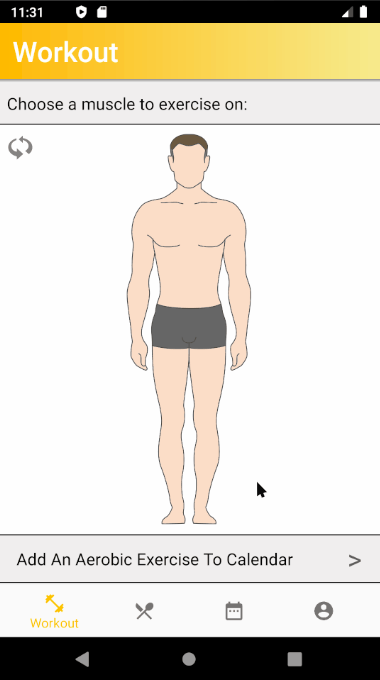

# About

In order to maximize muscle gain, this Android app allow users to keep track of their food intake and calories spending.

-- This is an android studio project, so you may clone the repo and try it for yourself if you want.

# Demo

### Home Screen 
-- customizable for male and female

  

### Setting Page 
-- Allow user to update their profile as they grow

-- Use BMR (Basal metabolic rate) to compute optimal calories user should have remaining at the end of the day

### Choose your workout
-- Choose a part of the body you want to work out

### Track food consumption

### Daily Result
-- A zero in "Today's Calories" represent optimal workout vs food intake

